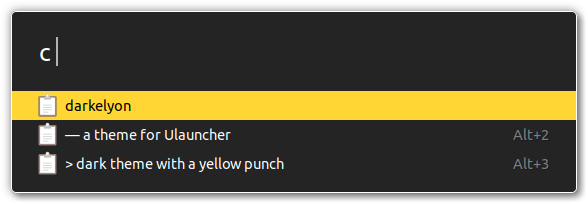

# darkelyon theme for Ulauncher

— a dark theme with a yellow punch.


The theme deliberatively hides the settings cog (still available when you hover over the right side of the bar).



## Installation

```sh
mkdir -p ~/.config/ulauncher/user-themes
cd ~/.config/ulauncher/user-themes
git clone https://github.com/jonapiron/darkelyon-ulauncher.git
```

Open Ulauncher and go to the settings. In the `Preferences` tab, choose your newly installed theme! 🤓